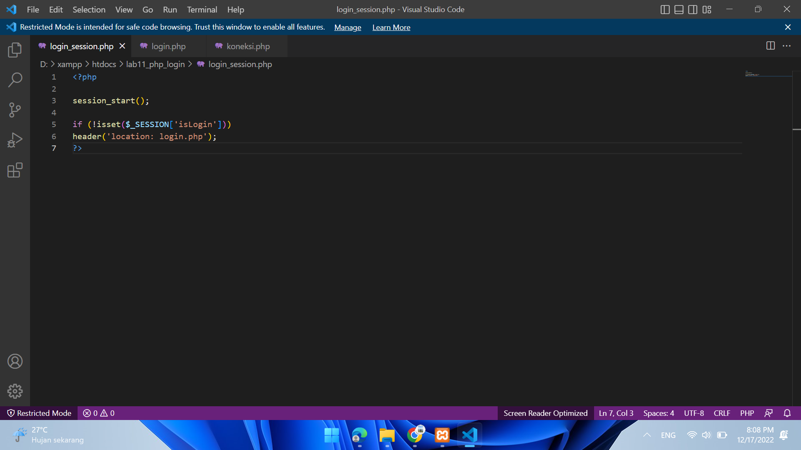
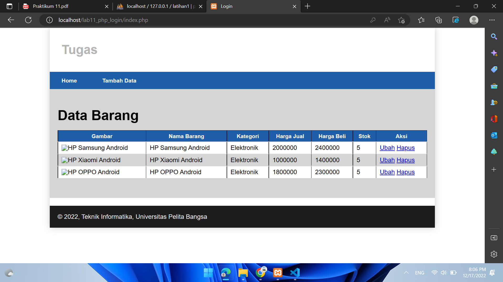

# Lab11Web
## Ananda Fachri Reynaldi
## 312110248
## TI.21.B1
<br>
<b>XAMPP</b>

Buka XAMPP Control Lalu Klik `Start` untuk menjalankan MySQL Server. Pastikan web server Apache dan MySQL Server sudah dijalankan.
<br>

Membuat Folder `lab11_php_login` pada root directory web server (d:\xampp\htdocs)
<br>

<b>phpMyAdmin</b>

Membuat Table User pada Database latihan1
<br>

Membuat file baru dengan nama `login_session.php`
<br>

Membuat file baru dengan nama `login.php`
<br>

Membuat file baru dengan nama `koneksi.php`
<br>

Setelah itu uji coba gunakan URL :
```
http://localhost/lab11_php_login/login.php
```
<br>

Mencoba untuk Login dengan User yang tadi diinput ke Database
<br>

Maka Hasilnya akan terbuka file `index.php`
<br>

Mencoba untuk Login dengan User yang tidak diinput ke Database, maka Hasilnya :
<br>